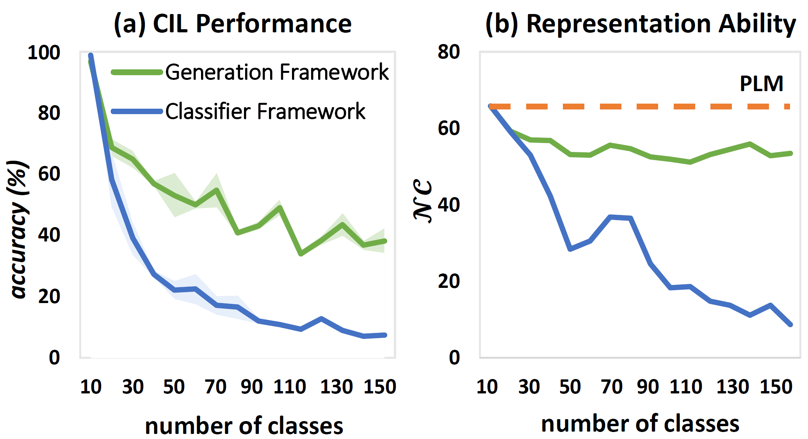

# Class-Incremental Learning based on Label Generation

This repository contains the code for our ACL'23 paper [Class-Incremental Learning based on Label Generation](https://arxiv.org/abs/2306.12619)
by [Yijia Shao](https://shaoyijia.github.io/), Yiduo Guo, [Dongyan Zhao](https://www.wict.pku.edu.cn/zhaodongyan/en/),
and [Bing Liu](https://www.cs.uic.edu/~liub/).

## Overview

In this work, we study the class-incremental learning (CIL) by taking PLMs' properties into account. We find using the
generation objective can better preserve PLMs' representation ability in the continual learning processing and yielding
much better CIL results.



We further propose the VAG (**V**ocabulary-**A**ware Label
**G**eneration) system for CIL which reframes CIL as a continual label generation problem.

## Requirements

We developed the code based on python `3.9.0`. The required packages can be found
in [requirements.txt](requirements.txt). You can run the following command to install them all:

```shell
pip install -r requirements.txt
```

## Datasets

We use [CLINC150](https://github.com/clinc/oos-eval), [Banking77](https://github.com/PolyAI-LDN/task-specific-datasets),
[20News](https://huggingface.co/datasets/newsgroup), [FewRel](https://github.com/thunlp/FewRel),
[TACRED](https://catalog.ldc.upenn.edu/LDC2018T24) for our experiments. The processed data can be found in `./data`
. (If you want to use data in other directory, please modify `DATA_ROOT` in [data.py](data.py)
accordingly.)

[data.py](data.py) provide an interface for preparing datasets for class-incremental learning.

## Experiments

In this work, we found that using PLMs in a generation framework is better than using them in the traditional
classification framework for CIL. [finetune_classifier.py](finetune_classifier.py) provides the entry point for the
classifier framework and [finetune_gen.py](finetune_gen.py) provides the entry point for the generation framework.

We include example scripts in `./script` for a quick start. To train VAG system on CLINC150 (for other datasets, use
corresponding scripts in `./script`), run

```shell
CUDA_VISIBLE_DEVICES=$gpu_id SEED=2021 BASELINE=bart_retrieve_bart-base_restrict_vocabulary_label_replay STORE_RATIO=0 LAMB=1 bash script/run_clinc_gen.sh
```

We use `BASELINE` to indicate different methods. You can set it to different values to experiment on the baseline
methods:

- `BASELINE`=bart_retrieve_bart-base_vanilla: Vanilla-G
- `BASELINE`=bart_retrieve_bart-base_ewc: EWC-G (we set `LAMB` to 5000 for EWC-G)
- `BASELINE`=bart_retrieve_bart-base_distill: KD-G (we set `LAMB` to 0.1 for KD-G)
- `BASELINE`=bart_retrieve_bart-base_l2p: L2P-G

For baselines using the classifier framework, run

```shell
CUDA_VISIBLE_DEVICES=$gpu_id SEED=2021 BASELINE=$BASELINE STORE_RATIO=0 LAMB=$LAMB bash script/run_clinc_classifier.sh
```

We also use `BASELINE` to indicate different methods:

- `BASELINE`=bart_classification_bart-base_vanilla: Vanilla
- `BASELINE`=bart_classification_bart-base_ewc: EWC (we set `LAMB` to 5000 for EWC)
- `BASELINE`=bart_classification_bart-base_distill: KD (we set `LAMB` to 0.1 for KD)
- `BASELINE`=bart_classification_bart-base_l2p: L2P

### Extend VAG system to exemplar-based setting

Notably, VAG system can be extended to **exemplar-based setting** when real replay data are available (see Section 4.2).
Run the following command to reproduce the experiment:

```shell
CUDA_VISIBLE_DEVICES=$gpu_id SEED=2021 BASELINE=bart_retrieve_bart-base_restrict_vocabulary_label_replay_experience_replay STORE_RATIO=$STORE_RATIO LAMB=1 bash script/run_clinc_gen.sh
```

We set `STORE_RATIO` to 0.01, 0.03, 0.05 in our experiments to try out different buffer sizes.

For replay-based baselines, run

```shell
CUDA_VISIBLE_DEVICES=$gpu_id SEED=2021 BASELINE=$BASELINE STORE_RATIO=0 LAMB=0 bash script/run_clinc_classifier.sh
```

- `BASELINE`=bart_classification_bart-base_experience_replay: ER
- `BASELINE`=bart_classification_bart-base_derpp: DER++
- `BASELINE`=bart_classification_bart-base_ldbr: LDBR

### Run VAG system on your own dataset

You can easily run VAG system on your own dataset with the following steps:

1. Add the data processing code in `get_dataset()` in [data.py](data.py).
2. Add a file under [./sequences](sequences) to indicate the task sequence. The sequence file name should be the same
   with your dataset name.
3. Complete the following script and run!
    ```shell
    for ft_task in  $(seq 0 $TASK_CNT-1);
    do
      CUDA_VISIBLE_DEVICES=$CUDA_VISIBLE_DEVICES python finetune_gen.py \
      --max_seq_length 128 \
      --ft_task ${ft_task} \
      --seed $SEED \
      --sequence_file 'sequences/20news' \
      --baseline bart_retrieve_bart-base_restrict_vocabulary_label_replay \
      --epoch 10 \
      --batch_size 8 --store_ratio 0 --learning_rate 1e-5 --lamb 1 --use_dev
    done
    ```

## Bugs or questions?

If you have any questions related to the code or the paper, feel free to email [Yijia](mailto:shaoyj@pku.edu.cn). If you
encounter any problems when using the code, or want to report a bug, you can open an issue. Please try to specify the
problem with details so we can help you better and quicker!

## Acknowledgements

We thank [PyContinual](https://github.com/ZixuanKe/PyContinual) for providing an extendable framework for continual
learning. We use their code structure as a reference when developing this code base.

## Citation

Please cite our paper if you use this code or parts of it:

```
@inproceedings{shao-etal-2023-class,
    title = "Class-Incremental Learning based on Label Generation",
    author = "Shao, Yijia  and
      Guo, Yiduo  and
      Zhao, Dongyan  and
      Liu, Bing",
    editor = "Rogers, Anna  and
      Boyd-Graber, Jordan  and
      Okazaki, Naoaki",
    booktitle = "Proceedings of the 61st Annual Meeting of the Association for Computational Linguistics (Volume 2: Short Papers)",
    month = jul,
    year = "2023",
    address = "Toronto, Canada",
    publisher = "Association for Computational Linguistics",
    url = "https://aclanthology.org/2023.acl-short.109",
    doi = "10.18653/v1/2023.acl-short.109",
    pages = "1263--1276",
}
```
